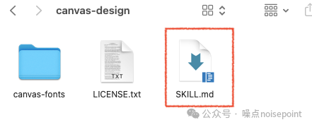
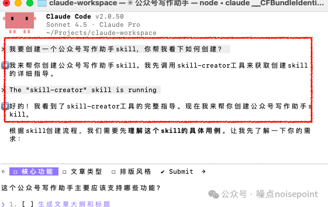
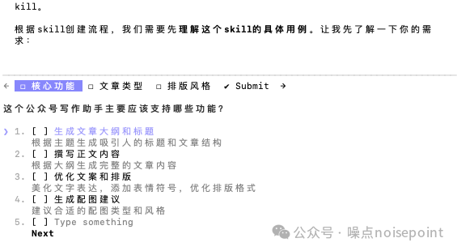
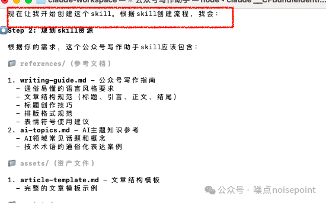
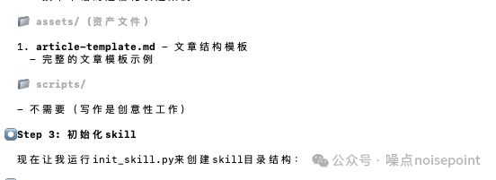
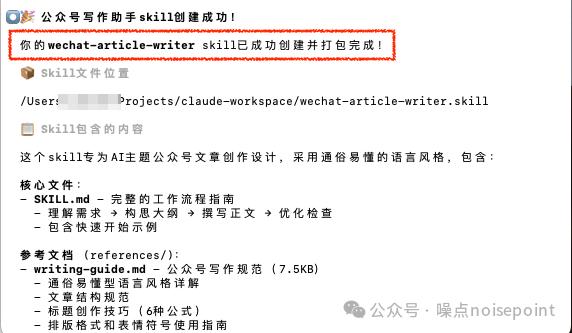
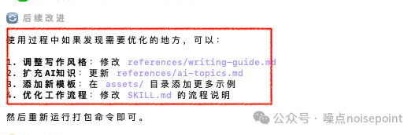
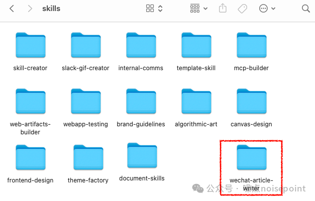

# 手把手教你创建Claude Skills   照着做就能跑

> 作者: 噪点noisepoint | 发布时间: 2025年11月27日 08:30

> 原文链接: https://mp.weixin.qq.com/s?chksm=eaa2ccb6ddd545a050e03597ed89d6856e169f5f344a5386a7a23fb050420bb4a253ee841c8c&exptype=unsubscribed_card_recommend_item_heat_tlfeeds&ranksessionid=1765950919_1&req_id=1765950919814930&mid=2247484339&sn=26298002993bc878502acd07bedefce3&idx=1&__biz=MzI2NTAzNDM0Ng%3D%3D&scene=169&subscene=200&sessionid=1765950908&flutter_pos=12&clicktime=1765950954&enterid=1765950954&finder_biz_enter_id=5&jumppath=HalfScreenTransparentActivity_1765950942619%2CWebViewStubProxyUI_1765950943439%2C20020_1765950943616%2C50094_1765950944107&jumppathdepth=4&ascene=56&fasttmpl_type=0&fasttmpl_fullversion=8043085-zh_CN-zip&fasttmpl_flag=0&realreporttime=1765950954539&devicetype=android-35&version=28004238&nettype=cmnet&lang=zh_CN&session_us=gh_a52ef2776f57&countrycode=CN&exportkey=n_ChQIAhIQa%2FK3zuHv%2BCinAr37SMaCsxLuAQIE97dBBAEAAAAAAMiBNR3FbF4AAAAOpnltbLcz9gKNyK89dVj0kRukp%2Fd2nXTEM6a0SMxP1d98Apwnklb7uWqZNM80T8fu9gF2pgDR3sz07GjUP%2Fa6gnBC91CpKvwJgPpAsaGDfINB1cgTnQMYEUwQNIi2K9KXo76QAEHlQuWR%2BNXg9m8AIvLb5Owf0md5PdSxJzKdsufoIDLDgYOOmdtDFhUfl5T0V%2BfBJrAroIXM9R3NO5I9AovJO0e30%2BlYonracGQ0z9UlTPh8azjbpglAuIfdePiddKMX0A2FbC1bKOugyJgxaP2Px6YQMcw%3D&pass_ticket=vV9Q3ccJG3L3lWFXNqLTuP5mqxk6sm6PRZzkD%2Fkul6AZgRH49qXfWbB0dBk3SkX5&wx_header=3

---

大家好，我是噪点

上篇文章有详细介绍了claude skills是什么，与mcp、subagent差别，以及在网页端和终端如何使用官方内置的skills[Claude Skills 超实用指南  从0到1带你用好 Skills](https://mp.weixin.qq.com/s?__biz=MzI2NTAzNDM0Ng==&mid=2247484321&idx=1&sn=cc50a9f24aa22536a9aa446001139a23&scene=21#wechat_redirect)；

这篇文章再来分享下如何自定义创建skills，核心分手动创建、借助skill-creator ai创建、注意事项3部分，下面依次介绍下：

**手动创建**首先，之前已经了解到skills本身就是一个文件夹，所以手动创建的大逻辑就是要创建一个特定的skills技能文件夹放到（～/.claude/skills）的文件夹里。

目录结构：

根据官方文档介绍 https://code.claude.com/docs/zh-CN/skills，skills文件夹目录结构为：

```
my-skill/├── SKILL.md           # 核心文件（必需）├── reference.md       # 参考文档（可选）├── examples.md        # 示例 （可选）├── scripts/           # 可执行脚本（可选）│   └── helper.py └── templates/         # 文件模板（可选）    └── template.txt
```

```

```

从这个目录结构中可以很清晰看到SKILL.md最为核心，同时也是必须要有的；里面是这个skills封装能力单元的具体规则；

claude会根据这个文档去决定什么时候触发技能，如何使用技能，也就是说一个最简单的skills只需一个SKILL.md 就可以。

而其他几个都是可选的：

- references.md：可以放一些参考文档、示例，也可以和examples.md放在一起，目的就是skill去参考这些示例更好执行任务；
- scripts：涉及任务执行需要代码脚本时，可以将脚本放在这个文档；
- templates：文件模板，快速生成标准化文件；

SKILL.md：

对于SKILL.md的创建也不复杂，主要由2部分组成，可参考下面这个结构：

```
--- 第一部分
name: your-skill-name   
description: Brief description of what this Skill does and when to use it
--- 第二部分
# Your Skill Name
## InstructionsProvide clear, step-by-step guidance for Claude.
## ExamplesShow concrete examples of using this Skill.
```

第一部分为 YAML frontmatter 元数据，包括name和description 2部分，作用让AI知道你有哪些技能可以去调用；

name就是你要创建的这个skill的名字，不要重复，只能用小写字母、数字和连字符，最多 64 字符；

description是对要创建的这个skill的描述，这个很重要，ai在自动调用skills时就是靠这个description来判断，所以需要写清楚这个skills是什么技能、什么时候用（也就是触发场景和关键词）；

举个例子，比如做了个ppt助手skill，那description至少要包括：这是一个做ppt的skill，可以根据用户上传的文档自动生成ppt，当用户提到创建ppt时进行使用等；

第二部分就是主体指令，也就是SKILL.md的核心部分，ai会根据这部分内容去具体执行任务；

建议核心包括3部分：工作流、规则要求、示例；其中工作流是为了清楚的告诉ai执行路径，第一步干什么、第二步干什么；规则要求是为了告诉ai在任务执行时要遵守的规范和限制；示例是给它一个参考，让他更好的执行任务。

我个人体验下来，主体指令这部分结构很像我们正常写提示词让ai做任务，包含角色、技能列表、工作流、规范限制、示例等；总之越清晰，ai执行的越好；

创建完这个SKILL.md(注意命名一定要大写）文档后，放到你的这个skills文件里，然后再将这个skills文件放到（～/.claude/skills）里就完成一个skill的手动创建了；




如果除了这个SKILL.md，还想再加些其他文档references.md、scripts等，同样都是放到创建的这个skills文件里；

然后就可以让ai进行测试自动调用；实测下来有时claude 自动调用没那么灵敏，这时可以选择直接主动调用，在你做任务时让他主动调用这个skill就行了。

**借助skill-creator创建**Skill-creator skill是官方内置的一个skill，也是帮我们创建skill的skill，如果觉得第一种方式手动创建skill有点门槛，尤其是刚接触skills的朋友，建议直接选择这个，这个就非常简单了，完全ai自动创建；

比如我这里演示创建一个公众号文章skill，以claude code为例，进入终端；

直接发给ai“我要创建一个公众号写作助手skill，你帮我看下如何创建”，claude就会调用skill-creator进行分析，对我们进行一步步引导；



我随便选了这个要求，进行了提交；




接着ai会针对你的提交的选项要求进行细节追问；


等所有细节确定了，claude就会自动创建这个公众号写作助手；





十分钟左右就自动创建好了，同时会自动打包，然后你也可以在本地skill文件夹里可以都看到；







然后就是正常测试使用了，如果觉得有不合适的地方，可以直接手动改文档，也可以直接和ai说，让ai改；

任何一个skill创建好了，都可以在终端claude code、claude 网页端、api同时使用。

**注意事项**1. 为了方便ai可以自动调用，description一定要写清楚，如功能、触达场景、触发词，要具象，不要笼统；比如公众号写作助手，不要只是写作助手；
2. 单一skill调用；在同一个任务建议只使用一个skill，多个skills同时开启效果反而不佳；
3. SKILL.md 是核心，核心包含元数据（name、description）、指令层（功能、规范、工作流、示例等）这些，有点类似常见提示词结构；

以上就是自定义创建skills的核心内容，可以手动创建，核心在于创建文件目录里面的SKILL.md，然后放到（～/.claude/skills）的文件夹；更简便的还可以借助自带的skill-creator进行创建，只需告诉ai自己的需求，让他进行一步步引导就自动创建打包好了；

同时这些文档内容都可以进行手动或让ai进行自动迭代优化；任何一个skill创建好了，都可以在终端claude code、claude 网页端、api同时使用。

如果觉得本篇分享对你有帮助，欢迎点赞、转发、评论；

对AI产品工具、vibe coding、AIGC内容感兴趣的内容也欢迎关注，期待交流，感谢！

